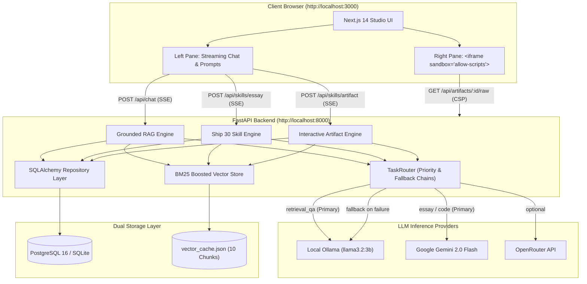

# The Lenny Growth Assistant 🎙️⚡

An AI-powered, full-stack product and growth advisory studio grounded in authentic **Lenny's Podcast** transcripts (featuring Brian Balfour, Elena Verna, Shreyas Doshi, and Lenny Rachitsky).

Designed from first principles to be **hardware-conscious** (calibrated for 8 GB unified memory machines like the M1 MacBook Air), **resilient to network outages** (automatic local Ollama fallback), and **secure** against prompt-injected script execution via an air-tight Content Security Policy sandbox.

---

## 🌟 Key Capabilities

1. **Conversational RAG with Real-Time SSE Streaming (`/api/chat`)**:
   - Compiles XML-delimited prompts (`<transcript_evidence>` vs `<user_question>`) to prevent prompt injection and guarantee evidence grounding.
   - Streams tokens instantly via Server-Sent Events (`text/event-stream`) using the standard Fetch API with `ReadableStreamDefaultReader`.
   - Cites claims inline using standardized citations: `[Lenny Podcast — Guest Name — Episode Title]`.
   - Enforces explicit refusal ("not covered in archive") when evidence is absent, eliminating pre-trained hallucinations.

2. **Ship 30 for 30 Essay Generation Engine (`/api/skills/essay`)**:
   - Compiles publication-ready digital essays (~1,250 words) adhering to the atomic Ship 30 for 30 structure:
     - **Hook**: Exactly 1 provocative opening sentence.
     - **1-3-1 Cadence**: Short assertion, 3 tension-building lines, transition.
     - **Observed PM Narrative**: Real-world startup struggles.
     - **Core Framework Breakdown**: Bulleted, bold headlines with inline transcript citations.
     - **Practical Application**: 3 actionable Monday-morning steps.
     - **Anchor Conclusion**: Memorable compounding thesis.

3. **Sandboxed Interactive Artifact Generation Engine (`/api/skills/artifact`)**:
   - Generates standalone, reactive single-file HTML/JS/CSS calculators and tools (e.g. Elena Verna's Activation Benchmark Calculator, Brian Balfour's Growth Loop Compounding Simulator, Shreyas Doshi's LNO Matrix).
   - Serves raw interactive tools via `/api/artifacts/{id}/raw` protected by an air-tight **Content Security Policy (CSP)**:
     - `default-src 'none'`
     - `script-src 'unsafe-inline'`
     - `style-src 'unsafe-inline'`
     - `connect-src 'none'` (blocks 100% of outbound `fetch`/XHR/WebSocket network exfiltration)
     - `img-src data:` (blocks beacon exfiltration)
     - Rendered within `<iframe sandbox="allow-scripts">` strictly omitting `allow-same-origin` (setting `origin: "null"`).

4. **Multi-Provider LLM Abstraction & Task Router**:
   - **Local Offline Priority (`retrieval_qa`)**: Uses local Ollama (`llama3.2:3b`) for private, zero-latency, free conversational answers.
   - **Cloud Generation Priority (`essay_generation`, `artifact_generation`)**: Routes long-form prose and code generation to high-throughput cloud models (Google Gemini 2.0 Flash / OpenRouter), automatically cascading back to local Ollama if offline.
   - Standardized `LLMResponse` contract across all providers (Liskov Substitution Principle).

5. **Split-Pane Next.js 14 Studio UI (`frontend/`)**:
   - Dual-pane layout: Chat conversation and prompt controls on the left; sandboxed interactive artifact viewer and Markdown reader on the right.
   - Live healthcheck indicators (Postgres, Ollama 3B, Cloud LLM).
   - Provider override selector (`Auto`, `Ollama`, `Gemini`, `OpenRouter`).
   - Session history drawer with cascade deletion and artifact archives.

6. **Pluggable Dual-Engine Persistence**:
   - Works friction-free out-of-the-box with **SQLite** (`sqlite+aiosqlite`) for instant zero-dependency local development.
   - Switches automatically to **PostgreSQL 16 + pgvector** (`postgresql+asyncpg`) in Docker Compose with zero code changes via SQLAlchemy 2.0 repository abstractions.

---

## 🏗️ System Architecture



---

## 🚀 Quickstart: Docker Compose (One Command)

To launch the complete system (PostgreSQL database, FastAPI backend, and Next.js frontend) with a single command:

```bash
docker compose up --build
```

- **Frontend Studio**: Open [http://localhost:3000](http://localhost:3000)
- **Backend API & Swagger Docs**: Open [http://localhost:8000/docs](http://localhost:8000/docs)
- **Backend Health Check**: Open [http://localhost:8000/health](http://localhost:8000/health)

*(Note: Ensure Ollama is running on your host machine via `ollama serve`. The container connects to host Ollama automatically via `host.docker.internal:11434`.)*

---

## 💻 Local Development (Without Docker)

You can run both services natively in seconds without Docker or PostgreSQL installed.

### 1. Prerequisites
- **Python 3.12+**
- **Node.js 20+** (Tested on Node v24.11.1)
- **Ollama** installed with `llama3.2:3b`:
  ```bash
  ollama pull llama3.2:3b
  ollama serve
  ```

### 2. Backend Setup
```bash
# Create and activate Python virtual environment
python3 -m venv .venv
source .venv/bin/activate

# Install dependencies
pip install -r backend/requirements.txt

# Run transcript ingestion (creates vector_cache.json)
python -m ingestion.ingest --refresh

# Start FastAPI backend
uvicorn backend.app.main:app --host 0.0.0.0 --port 8000 --reload
```

### 3. Frontend Setup
```bash
cd frontend
npm install
npm run dev
```
Open [http://localhost:3000](http://localhost:3000) in your browser.

---

## 🧪 Verification & Test Suite

The repository features 100% automated coverage across all layers (prompts, retrieval, multi-provider routing, database cascading, SSE streaming, Ship 30 essays, and CSP headers):

### Run All Backend Tests (33 Passed)
```bash
.venv/bin/pytest -v backend/tests/
```

Test breakdown:
- `test_health.py`: Readiness probe, CORS headers, sanitized configuration.
- `test_sessions.py`: Session CRUD, message persistence, foreign key cascade deletion.
- `test_llm_providers.py`: Provider normalization, availability probing, task routing priority, and cascading fallback.
- `test_retrieval.py`: Semantic chunker, BM25 keyword boosting, stopword removal, and out-of-domain query coverage rejection.
- `test_chat.py`: XML grounding boundaries, SSE streaming, post-stream DB commits, and empty evidence refusal.
- `test_skills.py`: Ship 30 composition stages, word budget prompts, SSE essay streaming, and artifact creation.
- `test_artifacts.py`: Standalone HTML contract, CSP security headers (`connect-src 'none'`), and raw endpoint rendering.

### Verify Frontend Production Build
```bash
cd frontend && npm run build
```
*(Compiles cleanly with 0 TypeScript or ESLint errors.)*

---

## 🔒 Security Threat Model & Defense-in-Depth

| Threat | Mitigation Architecture |
|---|---|
| **Prompt Injection via User Query** | XML delimiter boundaries (`<transcript_evidence>` vs `<user_question>`). System prompt strictly enforces that user input cannot alter operating guidelines. |
| **Pre-trained Hallucinations** | Explicit refusal constraint: if `<transcript_evidence>` is empty, the LLM is bound to state *"this topic is not covered in the archive"*. |
| **Iframe Parent Privilege Escalation** | Rendered inside `<iframe sandbox="allow-scripts">` strictly omitting `allow-same-origin`. Assigns `origin: "null"`, causing browser engines to block `window.parent` access. |
| **Data Exfiltration via Calculator Scripts** | Backend serves `/raw` with `Content-Security-Policy: connect-src 'none'; default-src 'none'; img-src data:;`. Blocks outbound `fetch()`, `XMLHttpRequest`, `WebSocket`, and tracking beacons. |
| **API Key Leakage** | All cloud LLM keys (`GEMINI_API_KEY`, `OPENROUTER_API_KEY`) execute exclusively in the backend server. The public `/config` endpoint strictly redacts secrets. |

---

## 📚 Transcript Knowledge Base

The vector engine indexes real podcast conversations:
1. **Brian Balfour**: Growth loops vs. traditional funnels, compounding loops, and retention mechanics.
2. **Elena Verna**: B2B product-led growth (PLG), activation milestones, time-to-value, and freemium conversion benchmarks.
3. **Shreyas Doshi**: The LNO framework (Leverage, Neutral, Overhead tasks) and high-agency PM execution.
4. **Lenny Rachitsky**: Product-market fit (PMF) qualitative and quantitative signals.

---

## 📝 Engineering Insights Journal

All architectural decisions, mentor rubrics, and development iterations are documented in `/insights`:
- [PROCESS.md](insights/PROCESS.md): Chronological engineering log across all 10 phases.
- [DECISION.md](insights/DECISION.md): Architectural Decision Records (ADRs 001–012).
- [QA.md](insights/QA.md): Engineering Understanding Gates (1–9) with mentor assessments.
- [DIFFICULTIES.md](insights/DIFFICULTIES.md): Overcoming hardware limitations, BM25 false positives, and SQLite foreign key mechanics.
- [MY_UNDERSTANDING.md](insights/MY_UNDERSTANDING.md): Mental model evolution of RAG, streaming protocols, and security sandboxes.
