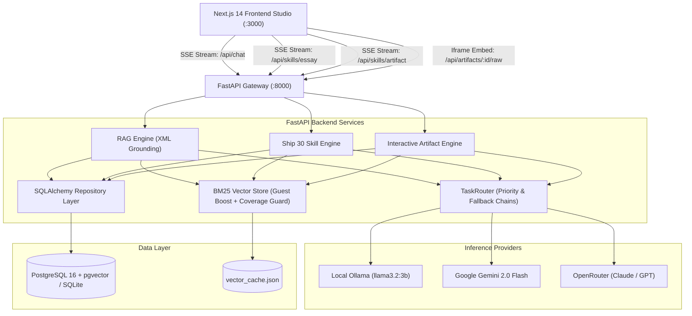
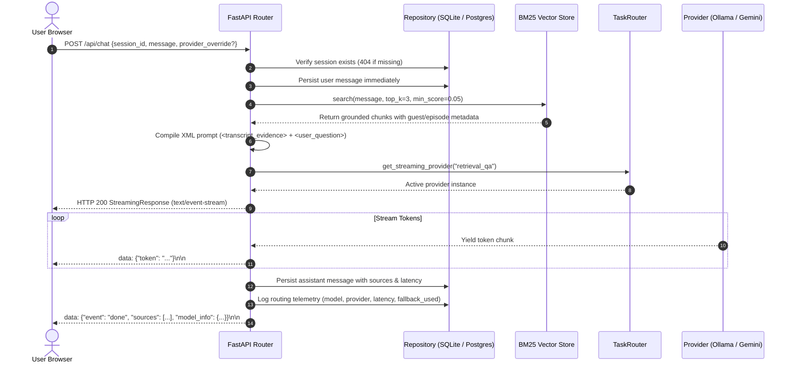
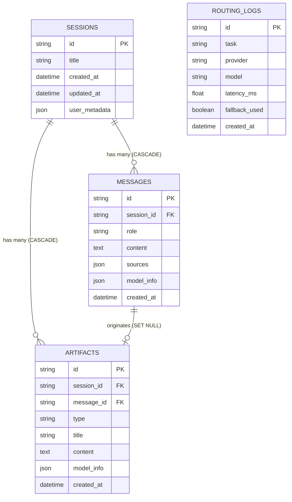

# System Architecture Specification (architecture.md)

## 1. Executive Summary

**The Lenny Growth Assistant** is an end-to-end full-stack AI system designed to deliver verified, citation-grounded product and growth advice. It combines retrieval-augmented generation (RAG) over Lenny's Podcast transcripts with long-form essay compilation (Ship 30 for 30) and client-side interactive calculators (sandboxed HTML/JS apps).

---

## 2. Component Diagram



---

## 3. Data Flow & Sequence Diagrams

### 3.1 Conversational RAG SSE Stream



---

## 4. Grounded Vector Retrieval Architecture

1. **Dialogue Chunking (`ingestion/chunker.py`)**:
   - Chunks transcripts at speaker turn boundaries (~1,200 characters) with a 200-character sliding overlap.
   - Preserves metadata tags on every chunk: `guest`, `source_title`, `url`, `chunk_index`.

2. **Boosted Lexical BM25 Engine (`backend/app/retrieval/vector_store.py`)**:
   - **Guest Weight Boosting (2.5x)**: When a query mentions a guest name (e.g. "Elena Verna" or "Brian Balfour"), chunks with matching guest names receive a 2.5x multiplier.
   - **Episode Title Boosting (1.8x)**: Chunks with relevant keywords in the title receive an extra 1.8x weight.
   - **English Stopword Removal**: Filters out common words ("the", "is", "at", "which", "on") to eliminate lexical noise.
   - **Query Term Coverage Guard**: For multi-word queries (≥3 content terms), a chunk is discarded unless it matches at least 2 distinct search terms. This strictly prevents common verbs from matching unrelated transcripts.

3. **Grounded Refusal Boundary**:
   - If no chunk exceeds the minimum score threshold (`min_score=0.05`), the retriever returns an empty list `[]`.
   - The system prompt strictly binds the model to refuse:
     > *"I searched Lenny's Podcast transcripts, but this topic is not covered in the archive."*
   - This eliminates pre-trained hallucination on out-of-domain queries.

---

## 5. Security & Sandbox Architecture

```
┌────────────────────────────────────────────────────────────────────────┐
│ HOST CLIENT: http://localhost:3000 (Next.js)                           │
│ Holds user session state, local preferences                            │
│                                                                        │
│   ┌────────────────────────────────────────────────────────────────┐   │
│   │ <iframe sandbox="allow-scripts" src="/api/artifacts/:id/raw">  │   │
│   │                                                                │   │
│   │ VERTICAL ISOLATION (Browser Engine)                            │   │
│   │ • sandbox="allow-scripts" permits interactive calculator math  │   │
│   │ • Strictly omits allow-same-origin -> origin: "null"           │   │
│   │ • window.parent access throws DOMException SecurityError       │   │
│   │                                                                │   │
│   │ HORIZONTAL CONTAINMENT (HTTP Content-Security-Policy)          │   │
│   │ • default-src 'none'                                           │   │
│   │ • script-src 'unsafe-inline'                                   │   │
│   │ • style-src 'unsafe-inline'                                    │   │
│   │ • connect-src 'none' (blocks fetch, XHR, WebSockets)           │   │
│   │ • img-src data: (blocks external beacon exfiltration)          │   │
│   └────────────────────────────────────────────────────────────────┘   │
└────────────────────────────────────────────────────────────────────────┘
```

---

## 6. Database Schema & Persistence Model


